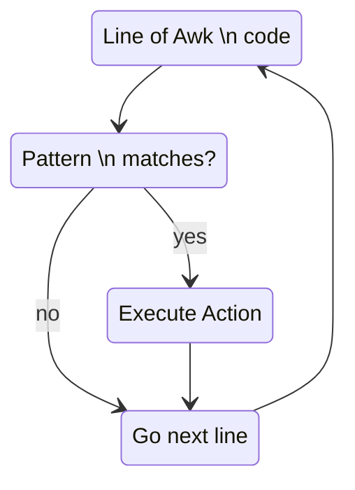

`pattern { action }`

```shell
awk 'pattern {action}' input_file
cat input_file | awk 'pattern {action}'
awk -f awk_script input_file
```


# Flow


# Patterns (Types) 
Pattern | Summary
--- | ---
`BEGIN { statements }` | The `statements` are executed once before any input has been read
`END { statements }` | The `statements` are executed once after all input has been read
`expression { statements }` | The `statements` are executed at each input line where the expression is true, that i, nonzero or nonnull
`/regex/ { statements }` |  The `statements` are executed at each input line that contains a string matched by the [[Regular Expressions]], implies `$0 ~ /regex/`
`compound pattern { statements }` | A `compound pattern` combines expressions with `&&`, `||`, `!` and `()` for grouping
`pattern1, pattern2 { statements }` | A `range pattern` matches each input line from a line matched by first pattern to the next line matched by second pattern, inclusive; the `statements` are executed at each matching line

# Operators
Type | Operators 
--- | ---
Assignment | `=` `+=` `-=` `*=` `/=` `%=` `^=`
conditional expression | `?:`
logical | \|\| `&&` `!`
matching | `~` `!~`
relational | `<` `<=` `==` `!=` `>=` `>`
arithmetic | `+` `-` `*` `/` `%` `^`
increment | `++i` `--i` `i++` `i--`
grouping | `()`


# Actions
The statements in actions can include:
-  `_expressions_`, with constants, variables, assignments, function calls, etc
- `{ _statements_ }`
- `print _expression-list_`
- `printf(format, _expression-list_)`
- `if (_expression_) _statement_`
- `if (_expression_) _statement_ else _statement_`
- `while (_expression_) _statement_`
- `do _statement_ while (_expression_)`
- `for (_expression_; _expression_; _expression_) _statement_`
- `for (_variable_ in _array_) _statement_`
- `break`
- `continue`
- `next`
- `exit`
- `exit _expression_`

# Built-in Variables
Variable | Meaning | Default
:-- | --- | :-:
`ARGC` | number of command-line arguments
`ARGV` | array of command-line arguments
`FILENAME` | name of current input file
`FNR` | record number in current file
`FS` | controls the input field separator | ` `
`NF` | number of fields in current record
`NR` | number of records read so far
`OFMT` | output format for numbers | `%.6g`
`OFS` | output field separator | ` `
`ORS` | output record separator | `\n`
`RLENGTH` | length of string matched by match function
`RS` | controls the input record separator | `\n`
`RSTART` | start of sting matched by match function
`SUBSEP` | subscript separator | `\034`

# Built-in Math Functions
- $atan2(y,x)$
- $cos(x)$
- $exp(x)$ equal $e^x$ 
- $int(x)$
- $log(x)$ equal $log_e(x)$
- $rand()$
- $sin(x)$
- $sqrt(x)$
- $srand(x)$