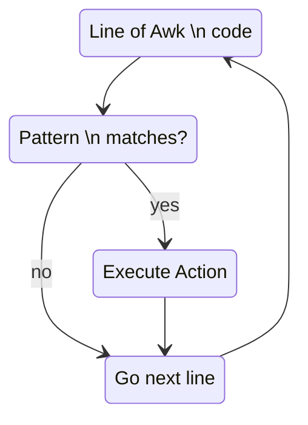

`pattern { action }`

pattern | summary
--- | ---
`BEGIN { statement }` | The `statement` are executed once before any input has been read
`END { statement }` | The `statement` are executed once after all input has been read
`expression {}`