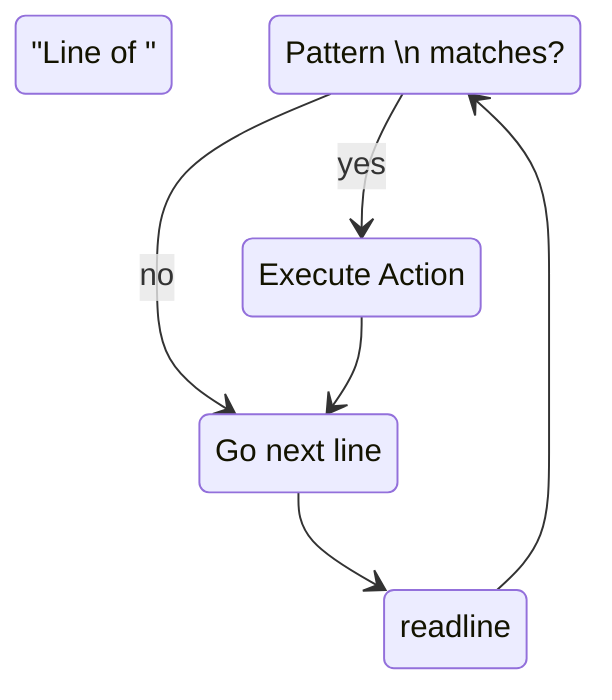

`pattern { action }`

```mermaid
stateDiagram-v2

line: "Line of "
state "Pattern \n matches?" as pattern
action: Execute Action
next: Go next line

readline --> pattern
pattern --> action: yes
pattern --> next: no
action --> next
next --> readline

```