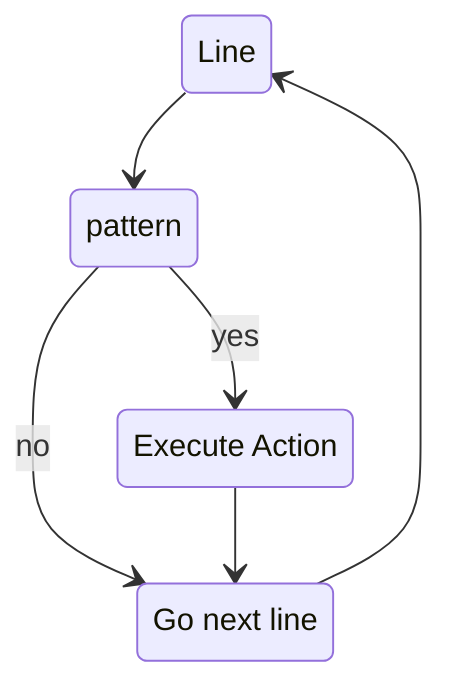

`pattern { action }`

```mermaid
stateDiagram

readline: Line
state pattern: Pattern \n matches? <<choise>>
action: Execute Action
next: Go next line

readline --> pattern
pattern --> action: yes
pattern --> next: no
action --> next
next --> readline

```