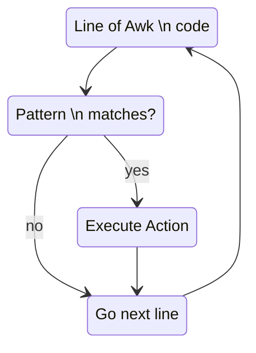

`pattern { action }`

# Flow

# Types 
Pattern | Summary
--- | ---
`BEGIN { statements }` | The `statements` are executed once before any input has been read
`END { statements }` | The `statements` are executed once after all input has been read
`expression { statements }` | The `statements` are executed at each input line where the expression is true, that i, nonzero or nonnull
`/regex/ { statements }` |  The `statements` are executed at each input line that contains a string matched by the [[Regular Expressions]], implies `$0 ~ /regex/`
`compound pattern { statements }` | A `compound pattern` combines expressions with `&& (AND)`, `|| (OR)`, `! (NOT)` and `()`
`pattern1, pattern2 { statements }` | A `range pattern` matches each input line from a line matched by first pattern to the next line matched by second pattern, inclusive; the `statements` are executed at each matching line

# Operators
Operator | Meaning
--- | ---
`<` | less than
`<=` | less than or equal to
`>` | greater than
`>=` | greater than or equal **to**
`==` | equal to
`!=` | not equal to
`~` | matched by 
`!~` | not matched by

# Actions
The statements in actions can include:
-  `expressions`, with constants, variables, assignments, function calls, etc
- `print expression-list`
- `printf(format, expression-list)`
- if (expression) statement