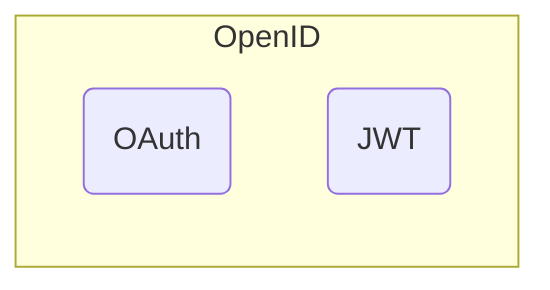

-  ***Идентификация*** `(id)?` - процедура определения уникального идентификатора пользователя в информационной системе
- ***Аутентификация*** `(id + key)?` - процедура проверки подлинности пользователя
- ***Авторизация*** `((id + key) + permissions)?` - процедура предоставления прав пользователю

---

# Standards
- SAML 2.0
- OpenID 1.0 -> OpenID 2.0 -> OpenID Connect (OIDC)



## OpenID Flow
- Implicit flow
- Authorization code flow
- Hybrid flow

# OAuth 2.0 (Protocol)

## Роли
- **Resource owner**
	*Конечный пользователь*, выдающий согласие *стороннему приложению* ^22176d
- **Client**
	*Стороннее приложение*, запрашивающее доступ у *сервера авторизации*  к *защищенному ресурсу* ^7eff33
- **Resource server**
	*Защищаемый на основе токена ресурс*, с минимальной проверкой токена
- **Authorization server**
	*Выделенный сервер* для выдачи токенов после *аутентификации* и *авторизации* ^a90aba

## Учетные данные

Grant type | Client type / Use case
---------- | -
Authorization code | обычные приложения, которые могут хранить в секрете свой код авторизации
Implicit | приложения, которые не могут хранить код авторизации
Password | Для доверенных клиент-приложений
Client credentials |
Refresh token |
SAML 2.0 bearer |
JWT bearer |
Device |
Token exchange |

Client credentials	For clients, such as web services, acting on their own behalf.
Refresh token	A special grant to let clients refresh their access token without having to go through the steps of a code or password grant again.
SAML 2.0 bearer	Lets a client in possession of a SAML 2.0 assertion (sign-in token) exchange it for an OAuth 2.0 access token.
JWT bearer	Lets a client in possession of a JSON Web Token (JWT) assertion from one security domain exchange it for an OAuth 2.0 access token in another domain.
Device	For devices without a browser or with constrained input, such as a smart TV, media console, printer, etc.
Token exchange	Lets applications and services obtain an access token in delegation and impersonation scenarios.

## Flow
- Регистрация [[Authentication & Authorization#^7eff33|клиента]] у [[Authentication & Authorization#^a90aba|сервера авторизации]] 
- Аутентификация [[Authentication & Authorization#^22176d|пользователя]]
- Получение обратной ссылки
- Аутентификация [[Authentication & Authorization#^7eff33|клиента]]
- Авторизация клиента

# JSON Web Token (JWT)
- **header**
- **payload**
	`json` - объект
- **signature**
	создается на основе секретного ключа информационной системы
```
JWT = base64(header) + "." + base64(payload) base64(signature)
```

# Connection
- session-based
- token-based