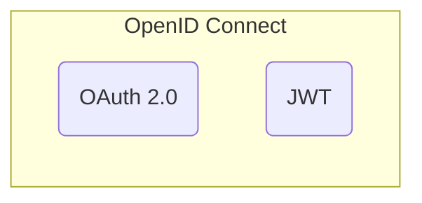

-  ***Идентификация*** `(id)?` - процедура определения уникального идентификатора пользователя в информационной системе
- ***Аутентификация*** `(id + key)?` - процедура проверки подлинности пользователя
- ***Авторизация*** `((id + key) + permissions)?` - процедура предоставления прав пользователю

---

**Connection**
- session-based
- token-based

**Standards** 
- SAML -> OpenID 1.0 -> OpenID 2.0 -> OpenID Connect (OIDC)
- OAuth 2.0
- JWT



# JWT

- **header**
- **payload**
	`json` - объект
- **signature**
	создается на основе секретного ключа информационной системы

```
JWT = base64(header).base64(payload).base64(signature)
```
