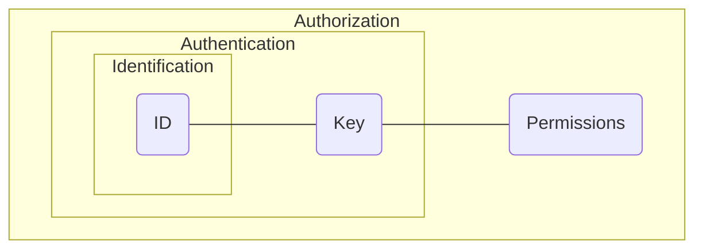
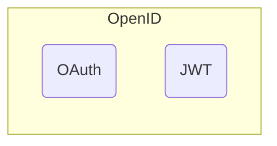
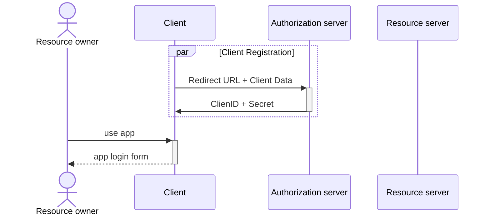

-  ***Идентификация*** `(id)?` - процедура определения уникального идентификатора пользователя в информационной системе
- ***Аутентификация*** `(id + key)?` - процедура проверки подлинности пользователя
- ***Авторизация*** `((id + key) + permissions)?` - процедура предоставления прав пользователю



---
# Connection
- session-based
- token-based

# Standards
- SAML 2.0
- OAuth 2.0 -> OAuth 2.1
- OpenID 1.0 -> OpenID 2.0 -> OpenID Connect (OIDC)



## OpenID Flow
- Implicit flow
- Authorization code flow
- Hybrid flow

# OAuth

## Роли
- **Resource owner**
	*Конечный пользователь*, выдающий согласие *стороннему приложению* ^22176d
- **Client**
	*Стороннее приложение*, запрашивающее доступ у *сервера авторизации*  к *защищенному ресурсу* ^7eff33
- **Resource server**
	*Защищаемый на основе токена ресурс*, с минимальной проверкой токена ^779c29
- **Authorization server**
	*Выделенный сервер* для выдачи токенов после *аутентификации* и *авторизации* ^a90aba

## Учетные данные

Grant type | Client type / Use case
---------- | -
**Authorization code** | Для сторонних приложения, которые могут хранить свой код авторизации в секрете
~~Implicit~~ | Для всех приложений, которые не могут хранить код авторизации в секрете
~~Password~~ | Для доверенных приложений
Client credentials | Для приложений работающих без участия пользователя
Refresh token | Для упрощенного процесса обновления токена
SAML 2.0 bearer | Для перехода с одного защищенного, на основе SAML, домена в другой, на основе OAuth
JWT bearer | Для перехода с одного защищенного, на основе JWT, домена в другой, на основе OAuth 
Device code | Для устройств с ограниченным вводом данных
Token exchange | Для сторонних приложений в случае сценариев делегирования

## Flow

```
		 +--------+                               +---------------+
		 |        |--(A)- Authorization Request ->|   Resource    |
		 |        |                               |     Owner     |
		 |        |<-(B)-- Authorization Grant ---|               |
		 |        |                               +---------------+
		 |        |
		 |        |                               +---------------+
		 |        |--(C)-- Authorization Grant -->| Authorization |
		 | Client |                               |     Server    |
		 |        |<-(D)----- Access Token -------|               |
		 |        |                               +---------------+
		 |        |
		 |        |                               +---------------+
		 |        |--(E)----- Access Token ------>|    Resource   |
		 |        |                               |     Server    |
		 |        |<-(F)--- Protected Resource ---|               |
		 +--------+                               +---------------+
```

- Регистрация [[Authorization#^7eff33|клиента]] у [[Authorization#^a90aba|сервера авторизации]] и получение **Client ID** и **Client Secret**
- Авторизация [[Authorization#^22176d|пользователя]]
- Редирект на [[Authorization#^7eff33|клиент]] с временным клюем авторизации (**code**)
- Запрос [[Authorization#^7eff33|клиентом]] access token (JWT) на основе временного ключа авторизации **Code**, **Client ID** и **Client Secret**
- Получение [[Authorization#^779c29|ресурсов]] на основе access token



# JSON Web Token (JWT)
- **header**
- **payload**
	`json` - объект
- **signature**
	создается на основе секретного ключа информационной системы
```
JWT = base64(header) + "." + base64(payload) + "." + base64(signature)
```


# WebAuthn

Расширение OAuth, для авторизации с помощью внешних ключей безопасности.

## Роли
![[Authorization#Роли]]
- **Authenticator**
	Внешний ключ безопасности
	- генерирует пару открытых / закрытых ключей
	- безопасно хранит закрытый ключ
	- предает открытый ключ
	- подписывает данные закрытым ключом 
- **Relying Party**
	Расширение роли **Authorization server**
- **User Agent**
	Расширение роли **Client**

