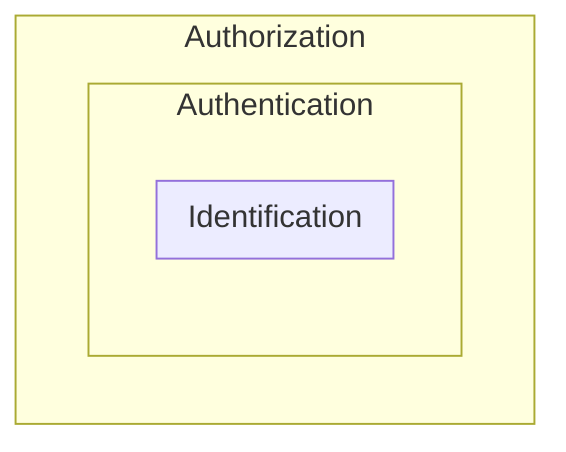
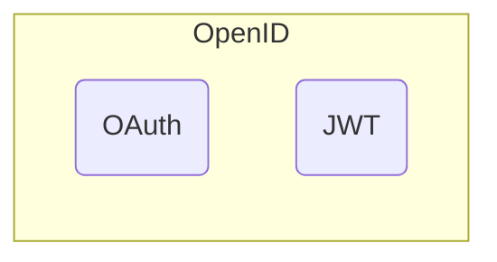
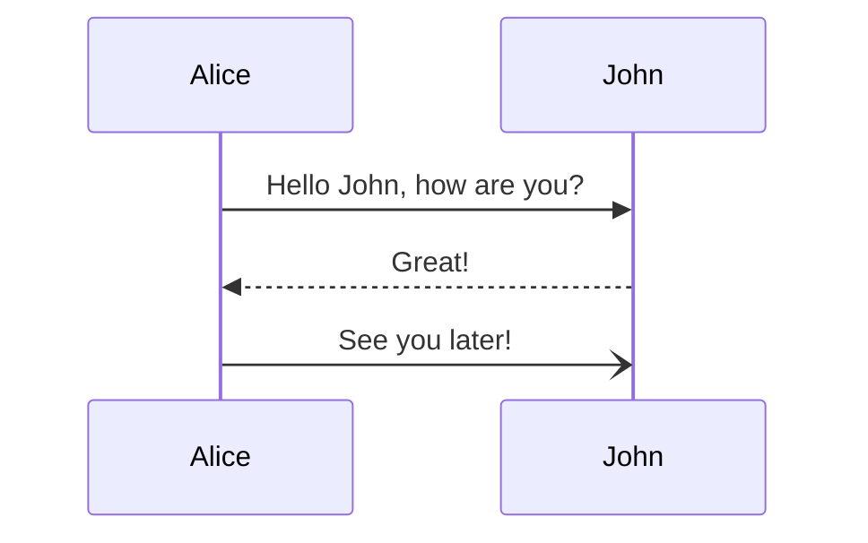

-  ***Идентификация*** `(id)?` - процедура определения уникального идентификатора пользователя в информационной системе
- ***Аутентификация*** `(id + key)?` - процедура проверки подлинности пользователя
- ***Авторизация*** `((id + key) + permissions)?` - процедура предоставления прав пользователю



---

# Standards
- SAML 2.0
- OpenID 1.0 -> OpenID 2.0 -> OpenID Connect (OIDC)



## OpenID Flow
- Implicit flow
- Authorization code flow
- Hybrid flow

# OAuth 2.0 (Protocol)

## Роли
- **Resource owner**
	*Конечный пользователь*, выдающий согласие *стороннему приложению* ^22176d
- **Client**
	*Стороннее приложение*, запрашивающее доступ у *сервера авторизации*  к *защищенному ресурсу* ^7eff33
- **Resource server**
	*Защищаемый на основе токена ресурс*, с минимальной проверкой токена
- **Authorization server**
	*Выделенный сервер* для выдачи токенов после *аутентификации* и *авторизации* ^a90aba

## Учетные данные

Grant type | Client type / Use case
---------- | -
Authorization code | Для сторонних приложения, которые могут хранить свой код авторизации в секрете
Implicit | Для всех приложений, которые не могут хранить код авторизации в секрете
Password | Для доверенных приложений
Client credentials | Для приложений работающих без участия пользователя
Refresh token | Для упрощенного процесса обновления токена
SAML 2.0 bearer | Для перехода с одного защищенного, на основе SAML, домена в другой, на основе OAuth
JWT bearer | Для перехода с одного защищенного, на основе JWT, домена в другой, на основе OAuth 
Device | Для устройств с ограниченным вводом данных
Token exchange | Для сторонних приложений в случае сценариев делегирования

## Flow
- Регистрация [[Authorization#^7eff33|клиента]] у [[Authorization#^a90aba|сервера авторизации]] 
- Авторизация [[Authorization#^22176d|пользователя]]
- Получение обратной ссылки на [[Authorization#^7eff33|клиент]] с временным клюем авторизации  
- Авторизация [[Authorization#^7eff33|клиента]] на основе временного ключа



# JSON Web Token (JWT)
- **header**
- **payload**
	`json` - объект
- **signature**
	создается на основе секретного ключа информационной системы
```
JWT = base64(header) + "." + base64(payload) base64(signature)
```

# Connection
- session-based
- token-based