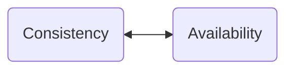

**Теорема CAP** - эвристическое утверждение о том, что в любой реализации *распределённой системы* возможно обеспечить не более двух из трёх следующих свойств:

- **Consistency** - Согласованность данных
- **Availability** - Доступность данный
- **Partition Tolerance** - Устойчивость к разделению 

#
При нарушение целостности распределенной сети:

