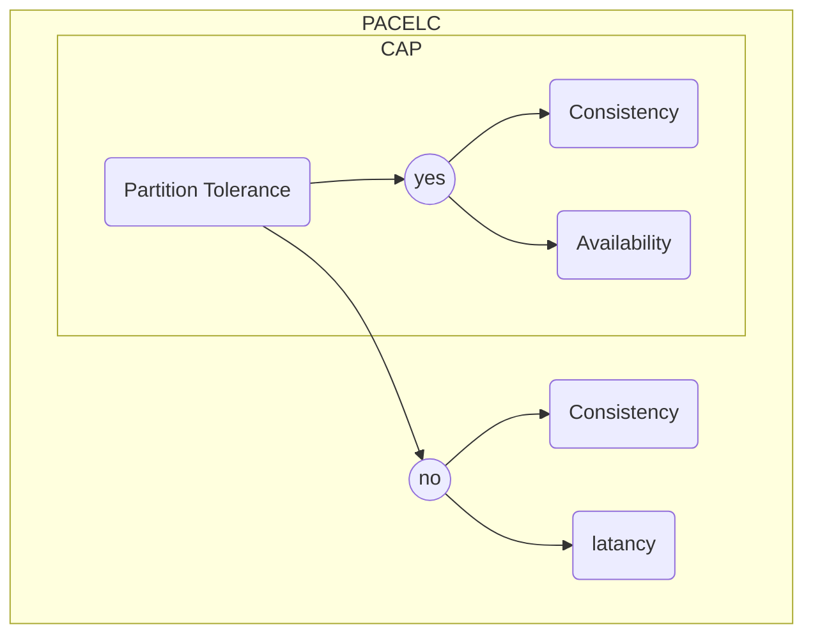

# CAP Theorem

**Теорема CAP** - эвристическое утверждение о том, что в любой реализации *распределённой системы* возможно обеспечить не более двух из трёх следующих свойств:

- **Consistency** *(согласованность данных)* - во всех вычислительных узлах в один момент времени данные не противоречат друг другу.
- **Availability** *(доступность)* - любой запрос к распределённой системе завершается корректным откликом, однако без гарантии, что ответы всех узлов системы совпадают.
- **Partition Tolerance** *(устойчивость к разделению)* - расщепление распределённой системы на несколько изолированных секций не приводит к некорректности отклика от каждой из секций.

# PACELC Theorem

- **Latency** - время, за которое клиент получит ответ и которое регулируется каким-либо уровнем consistency. Latency (задержка), в некотором смысле представляет собой степень доступности.

# BASE

- **Basic Availability** - Система отвечает на любой запрос, но этот ответ может быть содержать ошибку или несогласованные данные.
- **Soft-state** - Состояние системы может меняться со временем из-за изменений конечной согласованности.
- **Eventual consistency** *(конечная согласованность)* - Система, в конечном итоге, станет согласованной. Она будет продолжать принимать данные и не будет проверять каждую транзакцию на согласованность.

# ACID
- **Atomicity** *(атомарность)* - Атомарность гарантирует, что никакая транзакция не будет зафиксирована в системе частично. Будут либо выполнены все её подоперации, либо не выполнено ни одной. Поскольку на практике невозможно одновременно и атомарно выполнить всю последовательность операций внутри транзакции, вводится понятие «отката» (rollback): если транзакцию не удаётся полностью завершить, результаты всех её до сих пор произведённых действий будут отменены и система вернётся во «внешне исходное» состояние — со стороны будет казаться, что транзакции и не было (естественно, счётчики, индексы и другие внутренние структуры могут измениться, но, если СУБД запрограммирована без ошибок, это не повлияет на внешнее её поведение).

- **Consistency** - Транзакция, достигающая своего нормального завершения (англ. end of transaction, EOT) и тем самым фиксирующая свои результаты, сохраняет согласованность базы данных. Другими словами, каждая успешная транзакция по определению фиксирует только допустимые результаты. Это условие является необходимым для поддержки четвёртого свойства.

Согласованность является более широким понятием. Например, в банковской системе может существовать требование равенства суммы, списываемой с одного счёта, сумме, зачисляемой на другой. Это — бизнес-правило, и оно не может быть гарантировано только проверками целостности, его должны соблюсти программисты при написании кода транзакций. Если какая-либо транзакция произведёт списание, но не произведёт зачисления, то система останется в некорректном состоянии и свойство согласованности будет нарушено.

Наконец, ещё одно замечание касается того, что в ходе выполнения транзакции согласованности не требуется. В нашем примере списание и зачисление будут, скорее всего, двумя разными подоперациями, и между их выполнением внутри транзакции будет видно несогласованное состояние системы. Однако не нужно забывать, что при выполнении требования изолированности (см. ниже) никаким другим транзакциям эта несогласованность не будет видна. А атомарность гарантирует, что транзакция либо будет полностью завершена, либо ни одна из операций транзакции не будет выполнена. Тем самым эта промежуточная несогласованность является скрытой.

- **Isolation** - Во время выполнения транзакции параллельные транзакции не должны оказывать влияния на её результат. Изолированность — требование дорогое, поэтому в реальных базах данных существуют режимы, не полностью изолирующие транзакцию (уровни изолированности, допускающие фантомное чтение и ниже).
- **Durability** *(устойчивость)* - Независимо от проблем на нижних уровнях (к примеру, обесточивание системы или сбои в оборудовании) изменения, сделанные успешно завершённой транзакцией, должны остаться сохранёнными после возвращения системы в работу. Другими словами, если пользователь получил подтверждение от системы, что транзакция выполнена, он может быть уверен, что сделанные им изменения не будут отменены из-за какого-либо сбоя.

# Raft Algorithm
...