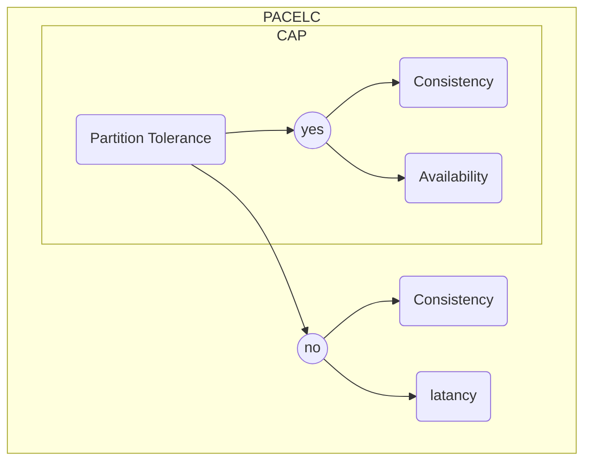

# CAP Theorem

**Теорема CAP** - эвристическое утверждение о том, что в любой реализации *распределённой системы* возможно обеспечить не более двух из трёх следующих свойств:

- **Consistency** *(согласованность данных)* - во всех вычислительных узлах в один момент времени данные не противоречат друг другу.
- **Availability** *(доступность)* - любой запрос к распределённой системе завершается корректным откликом, однако без гарантии, что ответы всех узлов системы совпадают.
- **Partition Tolerance** *(устойчивость к разделению)* - расщепление распределённой системы на несколько изолированных секций не приводит к некорректности отклика от каждой из секций.

# PACELC Theorem

# BASE  
- **Basic Availability** - Система отвечает на любой запрос, но этот ответ может быть содержать ошибку или несогласованные данные.
- **Soft-state** - Состояние системы может меняться со временем из-за изменений конечной согласованности.
- **Eventual consistency** *(конечная согласованность)* - Система, в конечном итоге, станет согласованной. Она будет продолжать принимать данные и не будет проверять каждую транзакцию на согласованность.

# ACID
...

# Raft Algorithm
...