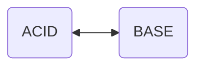

# BASE
> Гарантирует быстродействие
- **Basic Availability** - Система отвечает на любой запрос, но этот ответ может быть содержать ошибку или несогласованные данные.
- **Soft-state** - Состояние системы может меняться со временем из-за изменений конечной согласованности.
- **Eventual consistency** *(конечная согласованность)* - Система, в конечном итоге, станет согласованной. Она будет продолжать принимать данные и не будет проверять каждую транзакцию на согласованность.

# ACID
> Гарантирует сохранность данных
- **Atomicity** *(атомарность)* - никакое действие не будет зафиксировано в системе частично. Будет выполнено либо все, либо ничего.
- **Consistency**
- **Isolation** - параллельные действия в системе не должны оказывать влияния на результат текущего действия.
- **Durability** *(устойчивость)* - успешные проведенные изменения данных, гарантировано должны остаться сохранёнными.

# CAP Theorem

**Теорема CAP** - эвристическое утверждение о том, что в любой реализации *распределённой системы* возможно обеспечить не более двух из трёх следующих свойств:

- **Consistency** *(согласованность данных)* - во всех вычислительных узлах в один момент времени данные не противоречат друг другу.
- **Availability** *(доступность)* - любой запрос к распределённой системе завершается корректным откликом, однако без гарантии, что ответы всех узлов системы совпадают.
- **Partition Tolerance** *(устойчивость к разделению)* - расщепление распределённой системы на несколько изолированных секций не приводит к некорректности отклика от каждой из секций.

# PACELC Theorem

- **Latency** - время, за которое клиент получит ответ и которое регулируется каким-либо уровнем consistency (в некотором смысле представляет собой степень доступности).

# Raft Algorithm
https://raft.github.io/