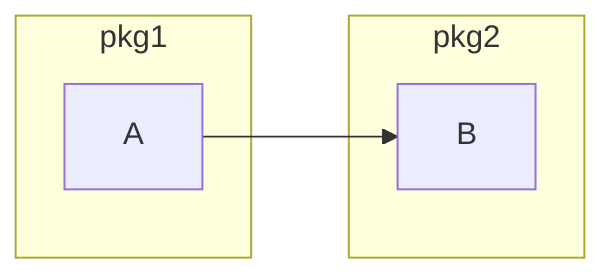
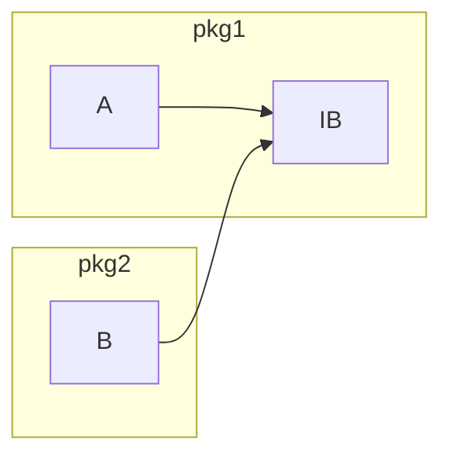

# Dependency Inversion

Before:

After:

# Dependency Injection

**Внедрение зависимости** (*англ. Dependency injection, DI*) — процесс предоставления внешней зависимости программному компоненту. Является специфичной формой «инверсии управления» (*англ. Inversion of control, IoC*), когда она применяется к управлению зависимостями. В полном соответствии с принципом единственной ответственности объект отдаёт заботу о построении требуемых ему зависимостей внешнему, специально предназначенному для этого общему механизму.
