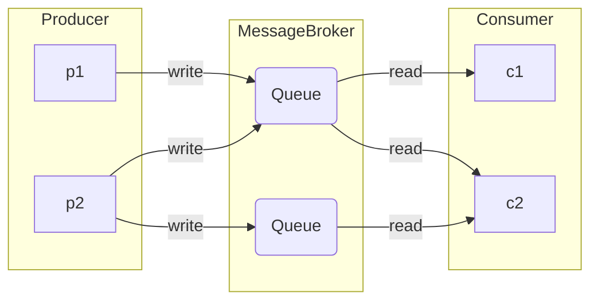

- `Producer / Publisher`
Отправляет сообщения в брокер
- `Consumer / Subscriber`
Получает и обрабатывает сообщения из брокера
- `Topic / Exchange / Тема`
Логическая единица, объединяющая сообщения по некоторому принципу

# Сравнение

[^1]: Количество сообщений в секунду обрабатываемых системой
[^2]: Способность постоянно хранить данные и возможность их восстановить

| Брокер                                | Scale[^1] | Data Persistent[^2] | Клиентские возможности |     |
| ------------------------------------- | --------- | ------------------- | ---------------------- | --- |
| [[Message Broker#Kafka\|Kafka]]       | > 1e6     | yes                 | one-to-many            |     |
| [[Message Broker#RabbitMQ\|RabbitMQ]] | ~ 50e3    | yes/no              | one-to-one/one-to-many |     |
| [[Message Broker#Redis\|Redis]]       | < 1e6     | partial             | one-to-one/one-to-many |     |
| NATSio                                |           |                     |                        |     |

## Kafka
### Особенности
- Высокая пропускная способность и долговечность
- Подписчики должны сами забирать сообщение
- Постоянно хранит данные
- Позволяет перечитывать сообщения
- Гарантирует порядок сообщений в топике
### Рекомендации
- Обработка больших объемов данных
- При реализации транзакционных или конвертерных систем
- При построении [[Architecture#^725ee5|событийно-ориентированной архитектуры]]
- При использование буфера для логов и метрик

## RabbitMQ
### Особенности
- Гибкая маршрутизация и долговечность
- Удаляет сообщение после доставки
- Сложности при горизонтальном масштабировании
### Рекомендации
- Нет большого потока данных
- Важна гибкость маршрутизации сообщений
- Важен факт доставки

## Redis
### Особенности
- В большинстве случаев используется как NoSQL СУБД
- Резервное копирование на определенный момент времени
- Имеет ограниченный функционал по сравнению с другими брокерами
### Рекомендации
- Обработка больших объемов данных
- Не требуется персистентность
- Необходима высокая скорость доставки сообщений

## NATS
### Особенности
- Простота конфигурации и развертывания
- Высокая производительность и низкие задержки
### Рекомендации
- Обработка больших объемов данных
- Не требуется персистентность
- Необходима высокая скорость доставки сообщений