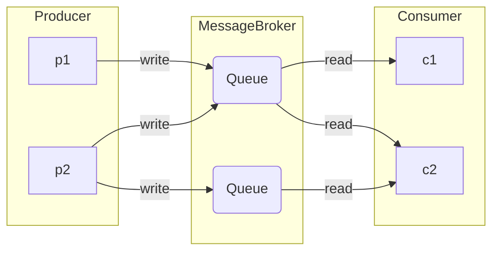

- `Producer / Publisher`
	Отправляет сообщения в брокер
- `Consumer / Subscriber`
Получает и обрабатывает сообщения из брокера
- `Topic / Exchange / Тема`
Логическая единица, объединяющая сообщения по некоторому принципу

# Сравнение

Брокер | Scale[^1] | Data Persistent[^2] | Клиентские возможности 
--- | --- | --- | --- | ---
Kafka | > 1e6 | yes | one-to-many
RabbitMQ | ~ 50e3 | yes/no | one-to-one/one-to-many
Redis | 

## Особенности
- Kafka
	- Подписчики должны сами забирать сообщение
	- Постоянно хранит данные
	- Позволяет перечитывать сообщения
	- Гарантирует порядок сообщений в топике
- RabbitMQ
	- Гибкая маршрутизация
	- 

[^1]: Количество сообщений в секунду обрабатываемых системой
[^2]: Способность постоянно хранить данные и возможность их восстановить