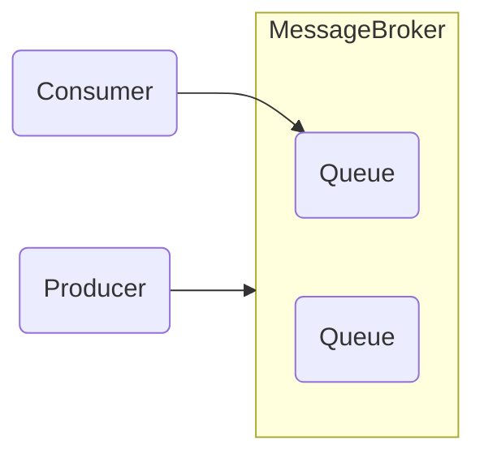

- `Producer / Publisher`
	Отправляет сообщения в брокер
- `Consumer / Subscriber`
Получает и обрабатывает сообщения из брокера
- `Topic / Exchange / Тема`
Логическая единица, объединяющая сообщения по некоторому принципу

