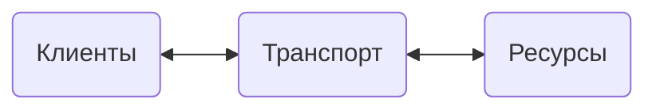

# Общие навыки

Работа с Octopus
- Знаком с базовыми принципами объектами k8s
- Умение создавать/конфигурировать деплой в Octopus

Работа с Kubernetes/Helm
- Понимание базовых элементов k8s
	- workloads
	- secretes
	- config-maps 
	- persistent volume claim
	- resistant volume
	- service
	- ingress
- Понимание структуры k8s
- Умение писать чарты helm

Работа с Grafana
- Понимание базовых функций.
- Умение ориентировать в дашбордах
- Понимание синтаксиса LogQL PromQL на уровне базовых запросов

Работа с Sentry
- Понимание базовых объектов Sentry, назначение сервиса
- Навыки по работе с Issue

Работа с SQL-like базами
- Умение составлять базовые запросы
- Умение работы с таблицами индексами

## База ООП

## SOLID
- single responsibility
- open/closed
- Liskov substitution
- interface segregation
- dependency inversion

## Паттерны
- Порождающие
	- фабричный метод
	- абстрактная фабрика
	- строитель
	- прототип
	- одиночка
- Структурные
	- адаптер
	- мост
	- декоратор
	- прокси
	- фасад
	- компоновщик
	- легковес
- Поведенческие
	- стратегия
	- цепочка обязанностей
	- команда
	- итератор
	- посредник
	- снимок
	- наблюдатель
	- состояние
	- шаблонный метод
	- посетитель

## REST

[Architectural Styles and the Design of Network-based Software Architectures](https://www.ics.uci.edu/~fielding/pubs/dissertation/top.htm)
1. Client - Server
2. Stateless
3. Cacheble
4. Uniform interface
5. Layed system
6. Code on demand



> Обычно под REST API подразумевают HTTP + Json

Best Practice
- конечные точки URL (endpoints) - существительные (ресурсы) ```/resource/{id}```
- множественное число ```/resources```
- документация ([Swagger/OpenAPI](https://swagger.io/))
- версия api указана в пути
- пагинация
- ssl -> tsl
- Правильное использование http-методов
- Правильное использование http-кодов ответов 
- принимать/отдавать всегда один и тот же формат упаковки, например json
- сложные запросы ```/resource/{id}/property```

## HTTP
Запрос: 
```
$methode $endpoint HTTP/$version
$headers
$body
```
Ответ:  
```
HTTP/$version $status_code
$headers
$body
```
CRUD:
- Create - POST
- Read - GET
- Update - PUT
- Delete - DELETE

## OpenAPI (Swagger)

UML и plantUML
	- диаграмма последовательностей
	- диаграмма классов
	- С4 диаграмма

ORM
	- ?
	- SQLAlchemy

## Книги
- Чистый код. Мартин #CC 
- Чистая архитектура. Мартин #CA 

## Тестирование
[ПроТестинг](http://www.protesting.ru/testing/)
[wiki](https://ru.wikipedia.org/wiki/%D0%A2%D0%B5%D1%81%D1%82%D0%B8%D1%80%D0%BE%D0%B2%D0%B0%D0%BD%D0%B8%D0%B5_%D0%BF%D1%80%D0%BE%D0%B3%D1%80%D0%B0%D0%BC%D0%BC%D0%BD%D0%BE%D0%B3%D0%BE_%D0%BE%D0%B1%D0%B5%D1%81%D0%BF%D0%B5%D1%87%D0%B5%D0%BD%D0%B8%D1%8F)

- Виды
	- По объекту тестирования
		- функциональное
		- производительности
			- нагрузочное 
			- стресс 
			- стабильность
		- конфигурационное
		- юзабилити
		- безопасности 
		- локализации 
		- совместимости
	- По значению внутреннего состояния
		- белый ящик
		- серый ящик 
		- черный ящик
	- По степени изолированности
		- unit
			- компонентное
			- модульное
		- integration
			- сверху вниз
			- снизу вверх
			- big bang
		- system 
		- приемочное
	- По признаку позитивности
		- позитивное 
		- негативное
	- По степени автоматизации
		- ручное 
		- полу автоматизированное
		- автоматизированное
	- По времени проведения 
		- альфа - тестирование 
		- бета - тестирование 
- Test doubles
	- stub (подменяет поведение объекта на определенное)
	- mock (подменяет объект на заглушку)
	- fake (подменяет объект на заглушку с определённым поведением)
- Полнота покрытия
	- операторов
	- условий
	- путей 
	- функций
	- входов/выходов
	- параметров

## OAuth
- ?
- Как работает под капотом по этапам
- Умение пользоваться библиотеками для подключения к IS4


## Python

asyncio
	- gather
	- async / await
	- loop cycle

pytest
	- stubs
	- mock
	- fixtures
	- parametrize

dynaconf
	- ?

fastapi
	- ?

sentry
	- ?

pyjwt
	- ?

pika + rmq
	- ?
	- exchange
	- bindings
	- queues