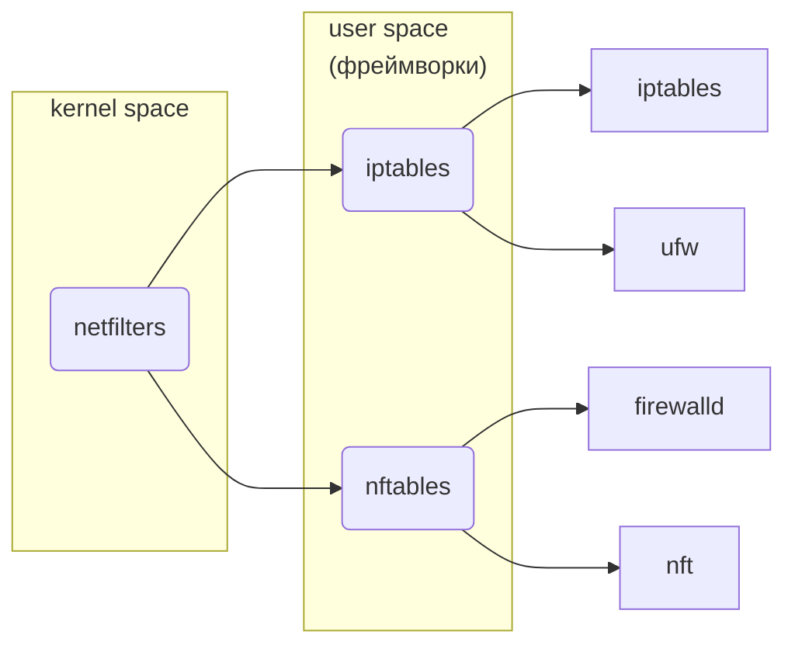

https://command-not-found.com/

# POSIX System
---

- uname | w
- lsblk | lscpu | lspci | lsusb | ...
- fuser
- type | which  | command | hash
- cal | date
- strace | rtrace | autrace
- xargs
- seq
- test | `[` | `[[`
- watch
- time -> [hyperfine](https://github.com/sharkdp/hyperfine)

## Shell
- sh -> bash -> zsh -> [fish](https://fishshell.com/)
- jobs | bg | fg

## Files
- cat | tac | tee | split -> [bat](https://github.com/sharkdp/bat)
- more | less
- shuf | sort | uniq
- xxd | hexdump
- ed -> grep -> [rg](https://github.com/BurntSushi/ripgrep) -> [batgrep](https://github.com/eth-p/bat-extras/blob/master/doc/batgrep.md)
- diff | cmp | patch -> [difft](https://github.com/Wilfred/difftastic) -> [batdiff](https://github.com/eth-p/bat-extras/blob/master/doc/batdiff.md)
- wc
- head | tail -- tr -> cut -> sed -> grep -> awk
- touch | cp -> fcp | mv | rm | mkdir | rmdir
- echo | printf
- zip | gzip | bzip -> tar
- ln
	```shell
	# softlink (create new inode)
	ln -s original_file symbolic_link_file
	
	# hardlink (use same inode)
	ln orginal_file hardlink_file
	```
- rsync
- zathura (pdf-reader)

## File System (FS)
- find -> [fd](https://github.com/sharkdp/fd)
- ls -> [exa](https://github.com/ogham/exa) | [lsd](https://github.com/lsd-rs/lsd)
- tree -> [broot](https://github.com/Canop/broot)
- [mc](https://midnight-commander.org/wiki)
- cd -> [zoxide](https://github.com/ajeetdsouza/zoxide)
### Disk
- du -> [dust](https://github.com/bootandy/dust)
- df -> [dysk](https://github.com/Canop/dysk)
- fdisk -> cfdisk | gdisk -> parted -> gparted
### FS Configs
- tune2fs
- blkid
`/etc/fstab` - монтирование файловой системы
`/etc/mke2fs.conf`

## Core
- modprobe
- modinfo
> Правила подгрузи модулей ядра (udev):
> `/usr/lib/udev/.` -> `/etc/udev/rules.d/.`
> Загрузка при включении ядра: `/etc/modules-load.d/*.conf`
> Условия для модуля: `/etc/modprob.d/*.conf`
### Boot
- GRUB
> 	Update boot config
> 	`/etc/default/grub` -> `grub-mkconfig` -> `/boot/grub`
### Load system
- systemctl `/etc/systemd/system/.` -> `/usr/lib/systemd/system/.`
	- enable | disable
	- start | stop
	- reload | restart
	- mask | unmask
- openrc

Run level | Systemd | SysVinit
--- | --- | ---
0 | power-off | halt
1 | rescue | single-user
2 | multi-user | multi-user - NFS
3 | multi-user | multi-user + NFS + Net
4 | multi-user | custom
5 | graphical | multi-user + NFS + Net + GUI
6 | reboot | reboot

## Security
- su -> doas -> sudo
- **SELinux**
### Access control
chmod | chown | chgrp | ...
### Isolation
chroot | chmod | chcpu | ... -> containers (docker)
### Firewall


## Processes
- kill | killall
- ps -> [procs](https://github.com/dalance/procs)
- top -> htop -> [btm](https://github.com/ClementTsang/bottom)
- nvtop
- [mprocs](https://github.com/pvolok/mprocs)
- free

## Power
- powertop
- s-tui
- [tlp & tlp-rdw](https://linrunner.de/tlp/index.html)
- [auto-cpufreq](https://github.com/AdnanHodzic/auto-cpufreq)

## Network
- wget -> curl -> [httpie](https://httpie.io/docs/cli/main-features)
- ping | traceroute
- nslookup
- ss
- ip
- nc (netcat)
- dig -> [dog](https://github.com/ogham/dog)
	`/etc/resolve.conf` - local DNS
- iwd | wpa_supplicant | nmcli -> nmtui
- ssh | scp | sftp | ssh-keygen | ssh-copy-id | ...
	`/etc/ssh/.` -> `~/.ssh/.`
### Network File System
- smb (sumba)
- nfs (nfs-utils)

## Sound

### Driver & Interface
Open Sound System #OSS -> **ALSA**
### Sound Server
- PulseAudio -> JACK -> PipeWire
- Network Audio System

## Super Search
fzf -> dmenu -> [rofi](https://github.com/davatorium/rofi)

## Docs
- man | help -> info -> [batman](https://github.com/eth-p/bat-extras/blob/master/doc/batman.md)
- [tldr](https://tldr.sh/)
- apropos (search manual pages) | `man -k` | `man --apropos`

## Logging
- rsyslog `/etc/rsyslog.conf`
- systemd-journal
- **journalctl**
- logger

## Scheduler
- at | atq | atrm
- batch
- cron | anacron
- systemd.timer | systemd-run


# Tiling window manager
---

- [i3](https://i3wm.org/)
- [qtile](https://qtile.org/) (python)
- awesome
- leftwm (rust)

## Status Bar
- **polybar**
- xmobar
## Volume Control
- amixer
- alsamixer
- pamixer
## Keyboard
- sxhkd
- setxkbmap
## Screenshot
- scrot -> **flameshot**
## Display
- xrandr
## Compositor
- xcompmgr
- compiz
- picom
## Brightness
- xbacklight -> brillo
- light
- clight
## Wallpapers
- nitrogen
- **feh**
## Notify
- dunst
```sh
notify-send
dunstify
```


# Soft
---

- pass | bitwarden
- qbittorrent | fragments (gnome)
- [entr](https://github.com/clibs/entr) (event notify test runner)
- [bat-extras](https://github.com/eth-p/bat-extras/tree/master)
- atuin (best serch for command history)
- eva (calculator)
- [ffmpeg](https://ffmpeg.org/)
- [pandoc](https://pandoc.org/)

## Terminal
- [alacritty](https://github.com/alacritty/alacritty) | kitty
- [starship](https://starship.rs/)
- tmux | zellif
- tput
- history

## Text Editor (VI)
- nano
- vi -> vim -> [nvim](https://neovim.io/)

### Plugins & utils:
Lazy (all plugins)-> Mason (nice lsp plugins)
- LSP
- tree-sitter (быстрый и правильный способо подстветки кода)
- Tagbar (навигация внутри файла)
- NERDTree
- Telescope (use: ripgrep, fzf)

### Configs
- [kickstart](https://github.com/nvim-lua/kickstart.nvim)
- [NvChad](https://nvchad.com/)
- [LazyVim](https://www.lazyvim.org/)
- [AstroNvim](https://astronvim.github.io/)
- [LunarVim](https://www.lunarvim.org/)

### Troubleshooting
- on Wayland install wl-clipboard
- [Nerd Fonts](https://github.com/ryanoasis/nerd-fonts)
	```shell
	git clone --depth 1 https://github.com/ryanoasis/nerd-fonts.git
	cd nerd-fonts
	./install.sh
	cd ../
	rm -rf nerd-fonts
	```


# Programming
---

- [tokei](https://github.com/XAMPPRocky/tokei)

## [Git](https://git-scm.com/book/en/v2)
- [lazygit](https://github.com/jesseduffield/lazygit)
- [gitui](https://github.com/extrawurst/gitui)

## Python
- **interactive**: python | bpython | ipython
- **formatters**: isort | black
- **linters**: pylint | flake8 | ruff
- **typing**: mypy
- **test runners**: unittest | pytest -> tox
- **documentation**: Sphinx
- **build & publish**: build + twine

## Rust
- irust
- [Evcxr](https://github.com/evcxr/evcxr)
- cargo-info

# Configs
---

```shell
# Locale
sudo echo "ru_RU.UTF-8 UTF-8" >> /etc/locale.gen
sudo locale-gen

# Misc USB visibility
sudo usermod -aG dialout $USER
```

## Arch

```shell
# base
# pacstrap /mnt base linux linux-firmware sof-firmware base-devel grub efibootmgr

# Bluetooth
sudo pacman -S bluez bluez-util bluez-plugins
sudo systemctl enable bluetooth.service
sudo systemctl start bluetooth.service

# Fonts
sudo pacman -S noto-fonts

# ALSA firmware
sudo pacman -S sof-firmware

# Graphics
# sudo pacman -S nvidia
# Nvidia Geforce gtx 780m
yay -S nvidia-470xx-dkms

# Video Acceleration (VA) API for Linux
sudo pacman -S libva libva-utils

# Gnome
sudo pacman -S gnome-themes-extra gnome-firmware
yay -S gnome-browser-connector
```

### Pacman
```shell
# list unused packages
sudo pacman -Qtdq
# remove unused
sudo pacman -Rns $(sudo pacman -Qtdq)
# clear cache
sudo pacman -Rc
sudo pacman -Rcc
```

### Flatpak
```shell
# install
sudo pacman -S flatpak

# add source
flatpak remote-add --user --if-not-exists flathub https://flathub.org/repo/flathub.flatpakrepo

```

[Advanced Linux Sound Architecture/Troubleshooting](https://wiki.archlinux.org/title/Advanced_Linux_Sound_Architecture)

### Система межпроцессного взаимодействия
libdbus -> dbus-brocker
```shell
sudo pacman -S dbus-brocker
sudo systemctl --global enable dbus-broker.service
```

### AUR Helper
```shell
sudo pacman -S --needed base-devel
git clone https://aur.archlinux.org/yay-git.git
cd yay-git
makepkg -si
```

## Fedora

```shell
sudo dnf install gstreamer1-plugins-{bad-\*,good-\*,base} gstreamer1-plugin-openh264 gstreamer1-libav --exclude=gstreamer1-plugins-bad-free-devel

sudo dnf install lame\* --exclude=lame-devel
sudo dnf group upgrade --with-optional Multimedia
```
[rpm fusion](https://rpmfusion.org/)

### DNF
Edit `/etc/dnf/dnf.conf`
```
skip_if_unavailable=True
fastestmirror=True
max_parallel_downloads=10
defaultyes=True
```

## Gnome

```shell
# Remove unused
sudo pacman -R gnome-boxes cheese gnome-contacts gnome-maps gnome-photos gnome-music totem gnome-weather epiphany

# Settings
gsettings set org.gnome.desktop.interface color-scheme prefer-dark
gsettings set org.gnome.desktop.interface enable-hot-corners false

gsettings set org.gnome.desktop.session idle-delay 1800
gsettings set org.gnome.settings-daemon.plugins.power power-button-action "interactive"
gsettings set org.gnome.settings-daemon.plugins.power sleep-inactive-battery-timeout 1200
gsettings set org.gnome.settings-daemon.plugins.power sleep-inactive-ac-type 1200

shortcut_gset=org.gnome.settings-daemon.plugins.media-keys
shortcut_custom=/org/gnome/settings-daemon/plugins/media-keys/custom-keybindings/custom0/

gsettings set ${shortcut_gset}.custom-keybinding:${shortcut_custom} binding '<Super>Return'
gsettings set ${shortcut_gset}.custom-keybinding:${shortcut_custom} name 'Terminal'
gsettings set ${shortcut_gset}.custom-keybinding:${shortcut_custom} command 'alacritty'
gsettings set ${shortcut_gset} custom-keybindings "['${shortcut_custom}']"

gsettings set org.gnome.desktop.input-sources per-window true
gsettings set org.gnome.desktop.input-sources sources "[('xkb', 'us'), ('xkb', 'ru')]"
```

### Extensions
- [Dash to Dock](https://github.com/micheleg/dash-to-dock)
- [Vitals](https://github.com/corecoding/Vitals)
- [AppIndicator and KStatusNotifireItem](https://github.com/ubuntu/gnome-shell-extension-appindicator)
- [Removable Drive Menu](https://gitlab.gnome.org/GNOME/gnome-shell-extensions)
- [Clipboard Indicator](https://github.com/Tudmotu/gnome-shell-extension-clipboard-indicator)
```shell
gnome-extensions enable clipboard-indicator@tudmotu.com
gnome-extensions enable appindicatorsupport@rgcjonas.gmail.com
gnome-extensions enable Vitals@CoreCoding.com
gnome-extensions enable dash-to-dock@micxgx.gmail.com
gnome-extensions enable drive-menu@gnome-shell-extensions.gcampax.github.com
```
